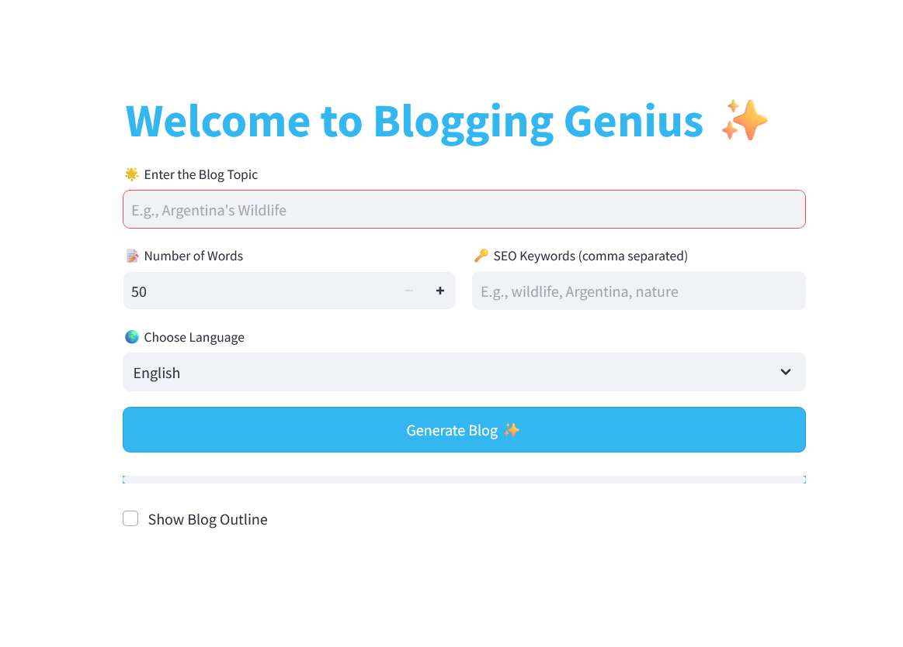

## BloggingGenius 4o – AI Blog Writer with SEO & Audio

Web application that leverages the GPT-4o model to create personalized blog posts based on user-defined topics. Users can specify the word count, preferred language, and SEO keywords to optimize visibility. The app generates a structured, well-written blog, viewable directly on the site. To enhance accessibility and interactivity, the blog can also be converted into speech using integrated text-to-audio features. An optional summary and downloadable version are provided, making content creation seamless and efficient.

## Installation and Use

1- Download the repo

2- Open it in VSC

2- Install the necessary dependencies by executing this command: pip install -r requirements.txt

3- Download the Llama model llama-2-7b-chat.ggmlv3.q8_0.bin from the website https://huggingface.co/TheBloke/Llama-2-7B-Chat-GGML. Ideally, this step would not be necessary, but I could not push the code from VSC
to GitHub because of how big the model is, so this is the easiest way then.

It should look like this: 

4- Create a folder in VSC called models and put the downloaded model there, and then save the changes.

5- Run the app using this command : streamlit run app.py

## App

